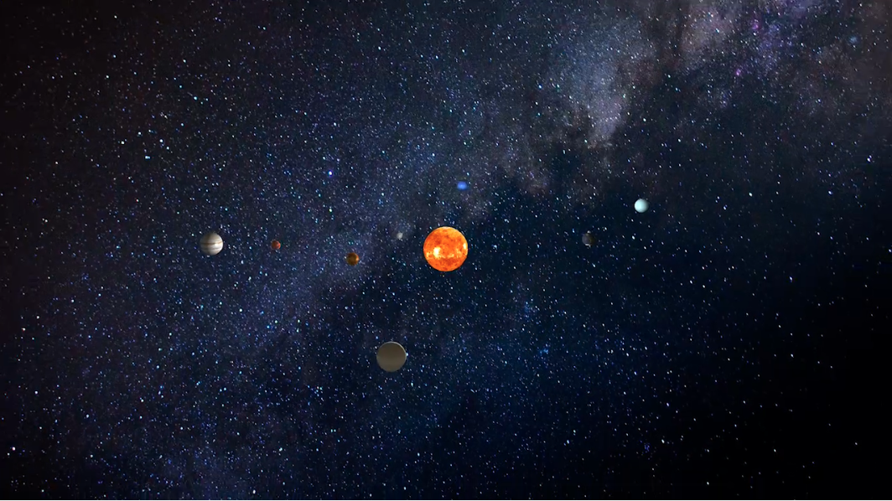

# OpenGL Programming - a small artificial solar system

[🎬 Watch the demo video](https://github.com/llada60/Artificial-Solar-System/raw/refs/heads/main/media/result.mp4)



---

**CSC_4IG01_TP** Interactive 3D Application Development, Fall 2024

---

Implement a solar system with OpenGL, using the following libraries::
- **OpenGL**: accessing the graphics processor.
- **GLM**: interface OpenGL and the window system of the operating system.
- **GLFW**: basic mathematical tools (vectors, matrices, etc.).


# Running the code

The code uses `cmake` as a build system. Run the following commands in the terminal to build and run the project:

```
> cmake -B build    # under the source directory where the CMakeLists.txt is located
> make -C build
> ./tpOpenGL        # it will try to load ./fragmentShader.glsl, ./vertexShader.glsl and ./media/*.jpg
```
